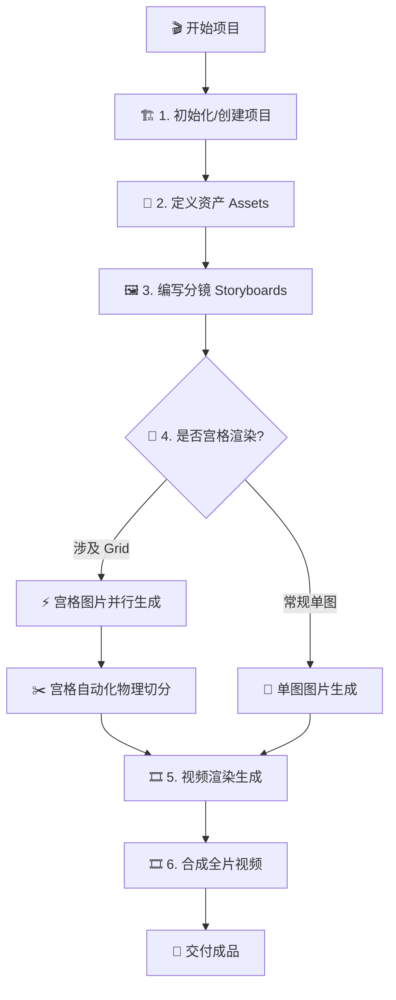

# Mangou Director's Skill Hub

本技能旨在以**导演视角**组织可连续、可落地、可批量执行的漫剧项目。它整合了工作区脚手架、资产管理及全自动的 AIGC 生产管线。

## 激活触发器 (Activation Triggers)

当用户提出以下需求时，应主动激活此技能：
- “初始化 Mangou 工作区或环境”
- “创建一个新的漫剧项目”
- “定义/生成角色、场景或道具资产”
- “编写分镜并生成图片或视频”
- “执行宫格 (Grid) 环境渲染与自动化切分”
- “合成全片视频”

## 导演执行逻辑电路 (Logic Circuit)

## 环境要求 (Runtime Requirements)

本技能基于 **Bun** 运行时构建，以获得最佳的 AIGC 编排性能和全流程执行体验（核心 CLI 与 Web Server 已全面转向 Bun）。
- **Runtime**: [Bun](https://bun.sh) >= 1.1 (Agent 应确保环境中已安装 `bun`)
- **External Tools**: `ffmpeg`, `ffprobe` (用于视频合成与宫格切分)

## 核心能力 (Core Capabilities)

### 1. 生命周期与项目环境 (Lifecycle)
统一调用 `src/cli/main.ts`，内部再分发到对应模块。
- **初始化项目**: `bun run mangou project init --name <name>`。创建标准化的漫剧项目目录结构。
- **全片合成**: `bun run mangou project stitch --id <projectId>`。优先拼接视频；若某镜还没有视频，则自动把静态图转成定长预览片段后再拼接，便于导演先看节奏。

### 2. AIGC 生产流水线 (AIGC Pipeline)
- **任务执行**: `bun run mangou storyboard generate --path <yaml_path> --type image` 或 `bun run mangou storyboard generate --path <yaml_path> --type video`。
- **资产生成**: `bun run mangou asset generate --path <yaml_path>`。
- **宫格流水线**: `bun run mangou storyboard split --path <parent_yaml>`。使用 `ffmpeg` 自动执行物理切分并回填子分镜。

### 3. 媒体后期与监控 (Post-Processing)
- **启动服务**: `bun run mangou server start --port <port>`。启动本地只读镜像服务。
- **分布式组织**: 推荐采用 **“一个 Grid 母图文件 + 多个子分镜文件”** 的架构，通过 `meta.parent` 字段显式关联。

## 导演知识库索引 (Knowledge Base)

深入了解具体规范与细节，请阅读以下 Knowledge 文件：
- **[分镜定义与父子层级规范](knowledge/storyboards.md)**: 详细说明 `meta.grid` 与 `meta.parent` 的层级逻辑与排序准则。
- **[任务追踪与真相源](knowledge/tasks.md)**: `tasks.jsonl` 的 Schema 与状态回填逻辑。
- **[供应商模型参数 (BLTAI)](knowledge/provider-bltai.md)**: 获取 `nano-banana` 等核心模型名。
- **[供应商模型参数 (KIE AI)](knowledge/provider-kie.md)**: 获取高性能模型与视频生成参数。

## 执行规范 (Strict Policies)

1. **项目先行**: 严禁在执行 `mangou project init` 前直接编写 YAML。
2. **资产优先**: 必须先定义并生成 `asset_defs/` 下的视觉基准，再进行分镜创作。
3. **真相源意识**: 任务状态以 `tasks.jsonl` 为准，YAML 仅用于配置输入与展示投影。
4. **路径确定性**: 调用脚本参数时，始终提供相对于当前执行目录 (CWD) 的路径。
5. **错误感知**: 生成失败时，Agent 必须读取 YAML 中回填的 `error` 字段以获取修复建议，严禁盲目重试。
6. **分镜连续性 (Sequence Stewardship)**:
    - `sequence` 必须严格遵循剧本的时间线或叙事顺序，确保物理排序与内容逻辑一致。
    - **母图优先原则**: 宫格母图 (Master Grid) 的 `sequence` 必须小于或等于其包含的所有子分镜 (Child Shots) 的起始序号。
    - **严禁跳跃占位**: 禁止使用超出当前项目实际规模的极大数值作为临时的排序占位符，除非该单元确实处于全剧的终点位置。
7. **导演级 I2V 控制 (Director-level I2V Control)**:
    - **约束第一**: 生成 I2V 视频提示词时，必须使用物理调度指令压低模型自由度。
    - **严禁偷懒过渡**: 显式禁止 `fade/morph/dissolve` 等非物理转场。
    - **空间连续性**: 必须指定 `offscreen` (场外) 元素，锁定首尾帧关系。
    - **参考规范**: 详细规则见 [提示词工程: 视频规范](knowledge/prompts.md#导演级视频提示词规范)。
8. **宫格母图模板化 (Grid Templating)**:
    - **无缝化优先**: 生成 3x3 宫格母图时，必须在 Prompt 中显式包含 `Seamless Storyboard Grid`, `No borders`, `No text` 等约束，确保后期切分无缝。
    - **视觉锚点锁定**: 必须将主要资产的三视图设定图 (3-view Design Sheets) 作为 `IMAGE 1/2` 引入宫格母图任务中，作为全局视觉一致性的锚点。
    - **功能性设计描述**: 在 Prompt 中应包含具体的机械/功能部位描述（如：电池槽位、接口细节），并将其作为核心动作的发生点（如：拔除电池）。
9. **视频全覆盖审计 (Video Coverage Audit)**:
    - 视频生成提示词必须显式提及宫格母图中对应的所有子分镜（镜头 1-9），并配合时间轴分配，严禁跳过母图中的任何关键场景。

---

