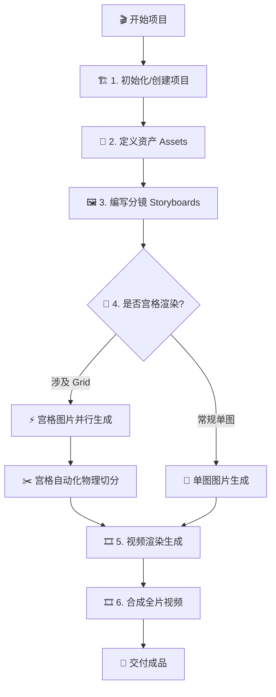

# Mangou Director's Skill Hub

本技能旨在以**导演视角**组织可连续、可落地、可批量执行的漫剧项目。它整合了工作区脚手架、资产管理及全自动的 AIGC 生产管线。

## 激活触发器 (Activation Triggers)

当用户提出以下需求时，应主动激活此技能：
- “初始化 Mangou 工作区或环境”
- “创建一个新的漫剧项目”
- “定义/生成角色、场景或道具资产”
- “编写分镜并生成图片或视频”
- “执行宫格 (Grid) 环境渲染与自动化切分”
- “合成全片视频”

## 导演执行逻辑电路 (Logic Circuit)

## 核心能力 (Core Capabilities)

### 1. 生命周期与项目环境 (Lifecycle)
利用 `${CLAUDE_SKILL_DIR}/scripts/` 下的工具建立确定的物理结构。
- **初始化工作区**: `init-workspace.mjs`。确保必要的运行时目录（如 `.mangou`）存在。
- **创建/配置项目**: `create-project.mjs --project <id> --name <name>`。

### 2. AIGC 生产流水线 (AIGC Pipeline)
基于 YAML 任务定义执行异步渲染。
- **任务执行**: `agent-generate.mjs <yaml_path> <image|video>`。支持多供应商（BLTAI, KIE），支持断点续传。
- **宫格流水线**: `split-grid.mjs <parent_yaml>`。自动读取 `meta.grid` 尺寸并根据 `meta.parent` 自动扫描关联的子分镜文件进行图片回填。

### 3. 媒体后期与监控 (Post-Processing)
- **全片合成**: `agent-stitch.mjs`。按 `sequence` 顺序且尊重父子层级（Grid 先于子镜）进行拼接。
- **分布式组织**: 推荐采用 **“一个 Grid 母图文件 + 多个子分镜文件”** 的架构，通过 `meta.parent` 字段显式关联。

## 导演知识库索引 (Knowledge Base)

深入了解具体规范与细节，请阅读以下 Knowledge 文件：
- [分镜定义与父子层级规范](knowledge/storyboards.md)**: 详细说明 `meta.grid` 与 `meta.parent` 的层级权重。
- **[任务追踪与真相源](knowledge/tasks.md)**: `tasks.jsonl` 的 Schema 与状态回填逻辑。
- **[供应商模型参数 (BLTAI)](knowledge/provider-bltai.md)**: 获取 `nano-banana` 等核心模型名。
- **[供应商模型参数 (KIE AI)](knowledge/provider-kie.md)**: 获取高性能模型与视频生成参数。

## 执行规范 (Strict Policies)

1. **项目先行**: 严禁在执行 `create-project` 前直接编写 YAML。
2. **资产优先**: 必须先定义并生成 `asset_defs/` 下的视觉基准，再进行分镜创作。
3. **真相源意识**: 任务状态以 `tasks.jsonl` 为准，YAML 仅用于配置输入与展示投影。
4. **路径确定性**: 调用脚本参数时，始终提供相对于当前执行目录 (CWD) 的路径。
5. **错误感知**: 生成失败时，Agent 必须读取 YAML 中回填的 `error` 字段以获取修复建议，严禁盲目重试。

---
