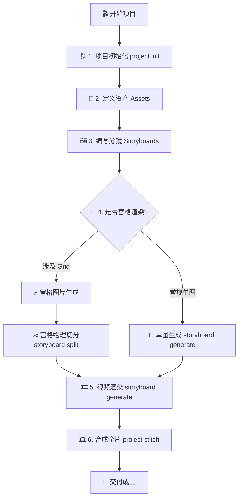

# Mangou Director's Skill Hub (v2.1)

本技能旨在以**导演视角**组织可连续、可落地、可批量执行的漫剧项目。采用 **“三权分立”** 架构：Agent 决策创意，CLI 自动执行回填，WEB 实时镜像监控。

## 激活触发器 (Activation Triggers)

当用户提出以下需求时，应主动激活此技能：
- “初始化 Mangou 项目”
- “定义/生成角色、场景或道具资产”
- “编写分镜并生成图片或视频”
- “执行宫格 (Grid) 渲染与自动化切分”
- “合成全片视频并预览”

## 导演执行逻辑电路 (Logic Circuit)

## 核心指令集 (Core Commands)

所有指令统一通过 `bun run src/main.ts <resource> <action>` 调用。

### 1. 项目管理 (Project)
- **初始化项目**: `bun run src/main.ts project init --name [id]`。
- **全片视频合成**: `bun run src/main.ts project stitch --id [id]`。

### 2. 资产管理 (Asset)
- **执行资产生成**: `bun run src/main.ts asset generate --path asset_defs/[type]/[name].yaml`。

### 3. 分镜管线 (Storyboard)
- **执行内容生成**: `bun run src/main.ts storyboard generate --path storyboards/[name].yaml --type [image|video]`。
  - **路径语法糖**: 支持在 `params.images` 中直接引用资产 YAML 路径。
- **宫格物理切分**: `bun run src/main.ts storyboard split --path storyboards/[parent].yaml`。

### 4. 实时监控 (Server)
- **启动镜像服务**: `bun run src/main.ts server start --port [port]`。通过 SSE 实现 UI 无感刷新。

## 导演知识库索引 (Knowledge Base)

- **[分镜层级规范](knowledge/storyboards.md)**: 详细说明 `meta.grid` 与 `meta.parent` 的层级逻辑。
- **[供应商参数 (BLTAI)](knowledge/provider-bltai.md)**: 获取 `nano-banana` 等模型参数。
- **[供应商参数 (KIE AI)](knowledge/provider-kie.md)**: 视频生成参数规范。
- **[任务日志规范](knowledge/tasks.md)**: `tasks.jsonl` 的回填与审计机制。

## 执行规范与策略 (Strict Policies)

1. **执行序列**: Agent 修改 YAML 文件 -> 启动 CLI 任务 -> CLI 自动将 `status` 与 `output` 回填至 YAML。
2. **路径确定性**: 所有 YAML 引用（如引用的角色资产）必须使用相对于**项目根目录**的显式路径。
3. **分镜连续性 (Sequence Stewardship)**: `sequence` 必须严格遵循剧本时间线，严禁跳跃占位。
4. **导演级 I2V 控制**: 生成视频提示词时，必须使用物理调度指令压低模型自由度，禁止 `fade/morph` 等非物理转场。
5. **宫格母图模板化**: 生成 3x3 宫格时，Prompt 必须包含 `Seamless Storyboard Grid` 约束，并锁定主要资产的视觉锚点。
6. **参数直传原则**: `tasks.params` 字段应直接对应 Provider 的原生 API。Agent 负责根据知识库填写正确的参数名。
7. **错误感知**: 生成失败时，Agent 必须读取 YAML 中回填的 `error` 字段进行修复，严禁盲目重试。

---
*注：本技能基于 Bun 运行时，要求环境中已安装 `bun`, `ffmpeg` 和 `ffprobe`。*
